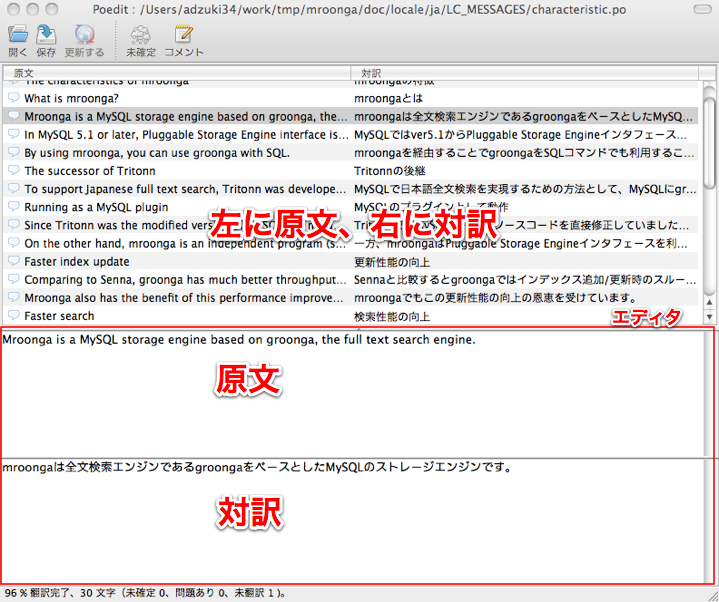

logaling-command を使った翻訳の進め方
=====================================

このページでは翻訳する時にどうやって logaling-command を使っていけばいいのかを、
実際のプロジェクトを通して説明していきます。

### mroonga プロジェクトの場合

[mroonga](http://mroonga.github.com/ja/) プロジェクトの翻訳を例に見て行きましょう。

mroonga では gettext ベースの [Sphinx](http://sphinx.pocoo.org/index.html) を使って
ドキュメントの国際化対応を行っています。この仕組みではベースの言語として英語を使い、
日本語などの他の言語には英語からその言語に翻訳します。
すべてのドキュメントは doc/source/ 以下に置いて、それを Sphinx で処理します。
ここでは Sphoinx がインストールされている状態で話を進めていきます。
Sphinx のインストール方法や使い方については Sphinx-Users.jp の
[Sphinxをはじめよう](http://sphinx-users.jp/gettingstarted/index.html) を参照してください。

### 翻訳の流れ
それでは、翻訳をはじめて行きましょう。
これが翻訳の流れです

1. mroongaのリポジトリをcloneします。
2. logaling-command の用語集を作成/登録します。
3. logaling-command の設定として翻訳する言語を指定します。
4. .po ファイルを更新します。
5. .po ファイルを編集します。
6. 必要に応じて logaling-command の用語集を参照したり、追加/編集します。
7. HTML ファイルを生成します。
8. HTML の出力を確認します。
9. 翻訳が完了するまで、4.-6.を繰り返します。
10. 翻訳作業の成果をmroongaプロジェクトに送ってください！

### mroongaリポジトリの clone の仕方
はじめに、GitHub 上の mroonga リポジトリを fork してください。 https://github.com/mroonga/mroonga にアクセスして Fork ボタンを押すだけです。これで自分の mroonga リポジトリを clone することができます。

	% git clone https://github.com/${YOUR_GITHUB_ACCOUNT}/mroonga.git

clone した後は configure する必要があります。

	% cd mroonga
	% ./autogen.sh
	% ./configure

この作業は初回セットアップ時のみの作業です。

### logaling-command を使う準備をする
#### プロジェクトに logaling-command を導入する。
ここでは、まずプロジェクトに logaling-command を導入する人向けに進めていきます。
既にプロジェクト（ここでは mroonga ）に logaling-command が導入されている場合はここは読み飛ばして、「既にプロジェクトに logaling-command が導入されている場合」を読んでください。
プロジェクトに logaling-command を導入する場合に最初にすることは用語集を作成することです。

では、用語集を作成します。
用語集を作成するには、「用語集名」と「原文の言語コード」とが必要です。
用語集名はプロジェクト名やリポジトリ名をそのまま利用するのがいいでしょう。ここでは、mroongaとなります。原文の言語コードはここではenとなります。

「訳文の言語コード」が必要ですが、「訳文の言語コード」は任意項目です。
多言語化という言葉があるように、原文の言語コードから複数の言語への翻訳がなされる可能性があるからです。
今回は、そのことを考慮して、「訳文の言語コード」は省略します。

それでは、以下のコマンドを実行してみて下さい。コマンドはプロジェクトのトップディレクトリで実行するのが良いでしょう。

    % cd ../../../
    % loga new mroonga en

この logaling-command 関連の操作でできたディレクトリやファイルは Github で共有するので、コミットした後に push して、pull request を送って master に取り込んでおいてもらいましょう。
( pull request の送り方については、本稿「翻訳の成果の送り方」に詳細がありますので、わからない場合はそちらを参考にしてみて下さい。)

プロジェクトにはじめてlogaling-commandを導入する人のための文章はここまでです。

#### 既にプロジェクトにlogaling-commandが導入されている場合

既にプロジェクトにlogaling-commandが導入されている場合には、データベースにそのプロジェクトの用語集を登録するだけで、すぐにlogaling-commandからプロジェクトの用語集を使うことができます。
用語集を登録するには、プロジェクトの.logalingがあるディレクトリか、それよりも下の階層で以下のコマンドを実行するだけです。

	% loga register

これで、logaling-command から mroonga の用語集を利用できるようになりました。

既にプロジェクトにlogaling-commandが導入されている場合の人のための文章はここまでです。

### logaling-command で訳文の言語コードの指定をする

さて、この mroonga プロジェクトの logaling-command の設定では「訳文の言語コード」が省略されています。ですが実際には、訳文の言語コードは翻訳をするためには必要になります。
そこで、logaling-command の global 設定を利用します。以下のコマンドを実行して、 global 設定として日本語（ja）を登録しておきましょう。

	% loga config target-language ja --global

これで、logaling-commandを使うための準備が出来ました。それでは、翻訳作業に入って行きましょう。

### .poファイルの更新の仕方
doc/locale/${LANGUAGE}/LC_MESSAGES ディレクトリで make update を実行すると .po ファイルを更新できます。（`${LANGUAGE}` は 'ja' など自分の言語の言語コードに置き換えてください。）

	% cd doc/locale/ja/LC_MESSAGES
	% make update

### .po の編集の仕方
.po ファイルを編集するためのツールがあります。.po ファイルは単なるテキストなので好きなエディタで編集できます。以下は .po ファイルの編集に特化したエディタのリストです。

* Emacs's [po-mode](http://www.gnu.org/savannah-checkouts/gnu/gettext/manual/html_node/PO-Mode.html) : gettextに同梱されています。
* [Poedit](http://www.poedit.net/) : .po専用エディタです。たくさんのプラットフォームで動作します。
* gted : これも.po専用エディタです。Eclipseプラグインとして実装されています。

ここでは、Poedit を使用することにします。
Poedit は大雑把に言うと上部と下部に分かれていて、上部は左に原文、右に訳文（訳がついていれば）
というリスト表示になっていて、そのリストの中でどれか一つを選択すると下部のエディタ部分に
原文と訳文（訳がついていれば）が表示されます。

Poeditサンプル：

翻訳をする場合には、この下部のエディタで原文に対して訳を入れていきます。

さっそく、characteristic.po を編集しながら見て行きましょう。

`Mroonga is a MySQL storage engine based on groonga, the full text search engine.`

という文章があります。この文章を上部リストで選択すると、下部エディタにこの文章が入るので、
エディタの下の方に訳を入れていきましょう。

`mroongaは全文検索エンジンであるgroongaをベースとしたMySQLのストレージエンジンです。`

ここで、`the full text search` を `全文検索` と訳しました。
この言葉は非常によく出てくることが予想されるので logaling-command で用語登録しておきましょう。
用語登録をするには `loga add [用語] [訳] [備考(あれば)]` を実行します。

	% loga add 'the full text search' 全文検索

では次の文章を見てみましょう。

`In MySQL 5.1 or later, Pluggable Storage Engine interface is introduced, and we can use custom storage engines easily. So we implement mroonga, so that we can use groonga through MySQL.`

この文章で `interface` という単語が2回現れます。
この単語はよく見かけるものですし、そのままカタカナにして翻訳されることはよくあることです。
でも、ちょっとまってください。「インターフェイス」と訳すのがいいか、あるいは「インタフェース」と訳すのがいいでしょうか？それとも、もっと別の方がいいでしょうか？
ささいなことですが、そんなことで悩んでしまうことがあるかもしれません。
そのような場合には、他のプロジェクトでこの単語がどのように訳されているのか見ることが出来たら便利ですよね。
logaling-command では、いくつかの有名プロジェクトの用語集をインポートして検索対象とすることができます。

まずはどんなプロジェクトの用語集があるかを確認します。

	% loga import --list
	debian_project : Debian JP Project (http://www.debian.or.jp/community/translate/)
	edict : The EDICT Dictionary File (http://www.csse.monash.edu.au/~jwb/edict.html)
	freebsd_jpman : FreeBSD jpman(http://www.jp.freebsd.org/man-jp/)
	gene95 : GENE95 Dictionary (http://www.namazu.org/~tsuchiya/sdic/data/gene.html)
	gnome_project : GNOME Translation Project Ja (http://live.gnome.org/TranslationProjectJa)
	mozilla_japan : Mozilla Japan (http://www.mozilla-japan.org/jp/l10n/term/l10n.html)
	postgresql_manual : PostgreSQL7.1 Manual (http://osb.sraoss.co.jp/PostgreSQL/Manual/)

ここで、edict と gene95 は辞書なので、それ以外のプロジェクトの用語集をとりあえずインポートしてみましょう。

	% loga import debian_project
	% loga import freebsd_jpman
	% loga import gnome_project
	% loga import mozilla_japan
	% loga import postgresql_manual

他の有名プロジェクトでの `interface` がどのように訳されているかを見てみます。

	% loga lookup interface
	  interface            インターフェース debian_project
	  network interface    ネットワークインターフェース     debian_project
	  interface            インターフェイス         mozilla_japan
	  user interface       ユーザインターフェイス           mozilla_japan
	  interface            インタフェース(インターフェース,インターフェイスでなく)[POSIX,kana]      freebsd_jpman
	  terminal interface   端末インタフェース[POSIX]        freebsd_jpman
	  interface            インターフェース gnome_project
	  interface            インタフェース   postgresql_manual

[Debian](http://www.debian.or.jp/community/translate/) と [GNOME](http://live.gnome.org/TranslationProjectJa) では「インターフェース」、
[Mozilla Japan](http://www.mozilla-japan.org/jp/l10n/term/l10n.html) では「インターフェイス」、
[FreeBSD](http://www.jp.freebsd.org/man-jp/) と [PostgreSQL7.1 Manual](http://osb.sraoss.co.jp/PostgreSQL/Manual/) では「インタフェース」となっています。
FreeBSD などは(インターフェース,インターフェイスでなく)と但し書きまであってわかりやすいですね。

どのタイプを選んでもいいと思いますが、mroonga プロジェクトでは「インタフェース」を採用することにします。
それでは、先ほどと同じ手順で用語集に登録しましょう。 freeBSD を習って備考も入れてみます。

	% loga add interface インタフェース 'インターフェース,インターフェイスでなく'

	% loga lookup interface
	  interface            インタフェース   # インターフェース,インターフェイスでなく     mroonga
	  interface            インターフェース debian_project
	  network interface    ネットワークインターフェース     debian_project
	  interface            インターフェイス         mozilla_japan
	  user interface       ユーザインターフェイス           mozilla_japan
	  interface            インタフェース(インターフェース,インターフェイスでなく)[POSIX,kana]      freebsd_jpman
	  terminal interface   端末インタフェース[POSIX]        freebsd_jpman
	  interface            インターフェース gnome_project
	  interface            インタフェース   postgresql_manual

登録した用語が最初に出てきました。これで、自分でどう訳すか忘れてしまった場合や、他の人が翻訳作業をする際に何と訳せばいいのか混乱することを避けることができます。

用語集の共有は Git で行うので、適宜コミットして push しておいてください。

.po ファイルの編集と logaling-command の用語登録・検索はこのように行なっていきます。

### HTMLファイルの生成方法
doc/locale/${LANGUAGE}/LC_MESSAGES ディレクトリで make update を実行すると .po ファイルを更新できます。（`${LANGUAGE}` は 'ja' など自分の言語の言語コードに置き換えてください。）

	% cd doc/locale/ja/
	% make html
全ての言語の HTML ファイルを生成するには doc/locale/ ディレクトリで make html を実行します。:

	% cd doc/locale
	% make html

※ .mo ファイルは make html で自動的に更新されるので、.mo ファイルのことを気にする必要はありません。

### HTML出力の確認の仕方
HTML ファイルは doc/locale/${LANGUAGE}/html/ 以下に出力されます。（`${LANGUAGE}` は 'ja' など自分の言語の言語コードに置き換えてください。）好きなブラウザで出力された HTML を確認してください。

	% firefox doc/locale/ja/html/index.html

### 翻訳の成果の送り方
翻訳の成果は GitHub の pull request かメールで送ってください。メールで送る場合はパッチでも .po ファイルそのものでも構いません。

#### pull request の送り方
pull request を送るためのコマンドライン

	% git add doc/locale/ja/LC_MESSAGES/*.po
	% git commit
	% git push
これで GitHub 上で pull request を送る準備ができました。あとは、GitHub 上の自分のリポジトリのページへアクセスして Pull Request ボタンを押すだけです。

※参考 [Help.GitHub - Sending pull requests.](http://help.github.com/pull-requests/)

#### パッチの送り方
パッチを作るためのコマンドライン

	% git add doc/locale/ja/LC_MESSAGES/*.po
	% git commit
	% git format-patch origin/master
カレントディレクトリに 000X-YYY.patch という名前のファイルができていると思います。これを groonga プロジェクトに送ってください！

参考 [コミュニティ](http://groonga.org/ja/docs/community.html) describes our contact information.

#### .poファイルの送り方
doc/locale/${LANGUAGE}/LC_MESSAGES/ 以下を .tar.gz や .zip などでアーカイブにして groonga プロジェクトに送ってください！（`${LANGUAGE}` は 'ja' など自分の言語の言語コードに置き換えてください。）こちらでアーカイブの中の内容をマージします。

参考 [コミュニティ](http://groonga.org/ja/docs/community.html) describes our contact information.

### 新しい言語の追加方法
新しい翻訳対象の言語を追加するコマンドライン

	% cd doc/locale
	% make add LOCALE=${LANGUAGE} # specify your language code such as 'de'.
		${LANGUAGE} は'ja'などの自分の言語の言語コードに置き換えてください。

参考 [Codes for the Representation of Names of Languages.](http://www.loc.gov/standards/iso639-2/php/English_list.php)

